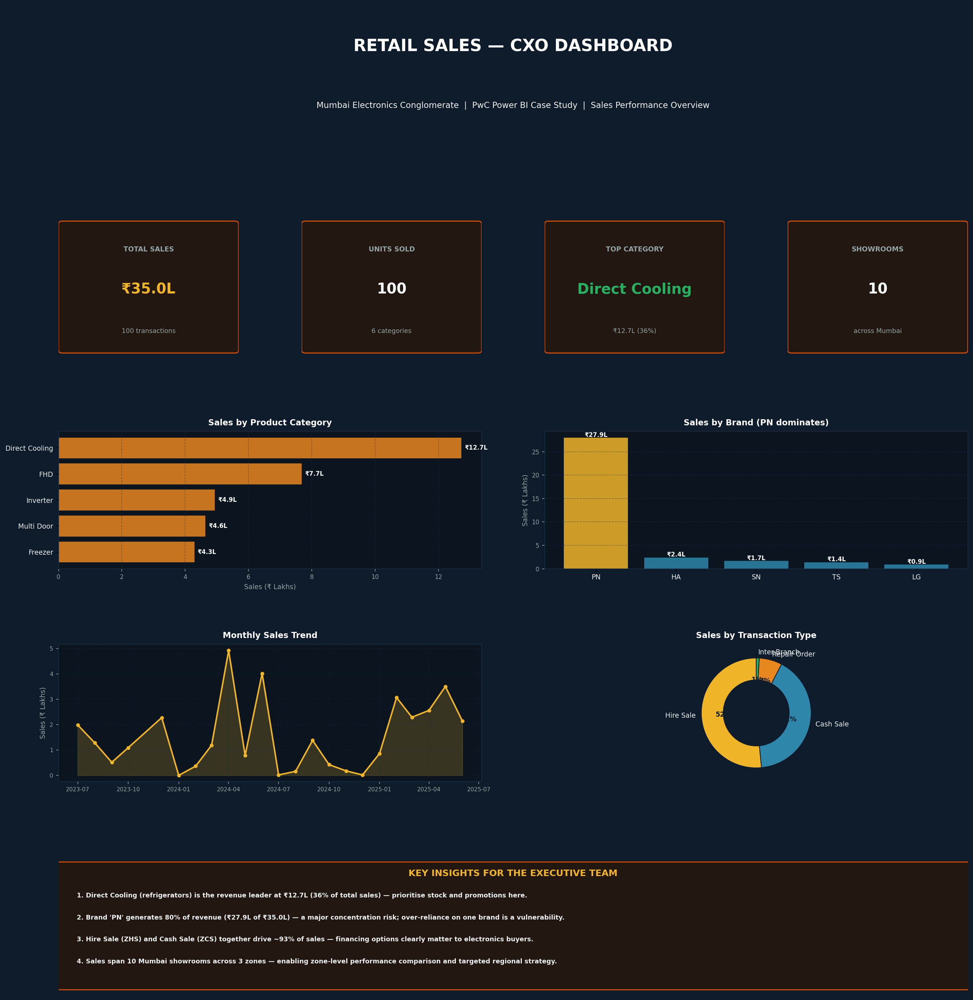

# PwC Power BI Case Study — Retail Sales & Finance Analytics
### Mumbai Electronics Conglomerate | CXO-Level Dashboards
**PhysicsWallah × PwC — Data Analytics with AI Program (NSDC Certified)**

---

## Business Problem

A Mumbai-based electronics retail conglomerate wanted to transform its retail operations using
data visualization. Executives and store managers lacked real-time visibility into sales
performance, inventory, and financial health. The task: build **two CXO-level Power BI
dashboards** — one for **Sales**, one for **Finance** — from a provided data-warehouse dataset,
designed for executive decision-making.

---

## The Data (Star Schema)

The dataset follows a professional **star-schema data warehouse** design:

**Sales dataset (7 tables):**
- Fact tables: `salesfact` (transactions), `salestarget` (goals)
- Dimensions: `datedim`, `dimproduct`, `dimprofitcenter`, `dimcustomer`, `dimshowroom`

**Finance dataset (7 tables):**
- Fact tables: `financefact`, `targetfact`, `budgetfact`
- Dimensions: `datedim`, `dimproduct`, `dimprofitcenter`, `generalledgermapping`

Fact and dimension tables join via keys (e.g. `salesfact.skukey` → `dimproduct.id`).

---

## Key Insights (Sales)

| Metric | Value |
|--------|-------|
| Total Gross Sales | ₹35.0 Lakhs (₹3,504,440) |
| Transactions | 100 |
| Top Category | Direct Cooling (refrigerators) — ₹12.7L (36%) |
| Top Brand | PN — ₹27.9L (80% of revenue) |
| Showrooms | 10 across 3 Mumbai zones |

1. **Direct Cooling (refrigerators)** is the revenue leader at ₹12.7L (36% of total).
2. **Brand 'PN' generates 80% of revenue** — a major concentration risk worth flagging to executives.
3. **Hire Sale + Cash Sale** drive ~93% of revenue — financing options matter for big-ticket electronics.
4. Sales span 10 showrooms across Western, Central, and Southern zones — enabling regional benchmarking.

---

## Dashboard

---

## KPIs / DAX Measures Implemented

The case provided the standard executive KPI framework, implemented as DAX measures:

**Sales:** Sales Amount, Sales Quantity, YTD Sales (Amount & Qty), Achievement % (Actual vs Target)

**Finance:** Revenue, COGS, Gross Profit, Net Profit After Tax, EBITDA, OPEX, Budgeted Revenue & Expense

See `DAX_measures.md` for the full formulas.

---

## Repository Contents

| File | Description |
|------|-------------|
| `pwc_analysis.py` | Python analysis of the Sales & Finance datasets |
| `pwc_sales_dashboard.png` | Sales CXO dashboard |
| `DAX_measures.md` | DAX measure formulas (Sales + Finance KPIs) |
| `case_study_learnings.md` | Problem breakdown + what I learned |
| `Sales Dataset.xlsx` / `Finance Dataset.xlsx` | Source data warehouse tables |

---

## Tools & Skills

**Tools:** Power BI (Power Query, DAX), Python (Pandas), Excel

**Skills demonstrated:**
- Working with a star-schema data warehouse (fact + dimension tables)
- Joining fact and dimension tables on keys
- Building executive (CXO) KPIs: YTD, Achievement %, Gross Profit, EBITDA
- Sales and financial performance analysis
- Translating raw transactions into executive-level insights

---

## About

**Aquib Azam Ansari**
MBA in Agribusiness Management | Data Analytics with AI (NSDC & PwC Certified)
Email: aquib.azam8@gmail.com

*PwC-aligned case study completed as part of the PhysicsWallah Data Analytics with AI program (2026).*
